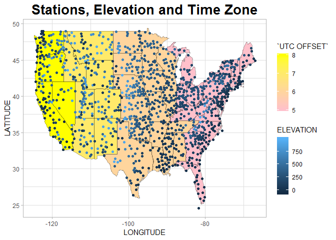

## Lab1

substitute a link to Lab1 repo here
 <http://rmarkdown.rstudio.com>.
 
## Buid a book

error now

## Weather station


```r
library(tidyverse)

weather <- read_fwf("ushcn-v2.5-stations.txt",
                    col_positions = fwf_positions(start = c(1, 3, 4, 6, 13, 22, 33, 39, 42, 73, 80, 87, 94), end = c(2, 3, 5, 11, 20, 30, 37, 40, 71, 78, 85, 92, 95), col_names = c("COUNTRY CODE", "NETWORK CODE ", "ID PLACEHOLDERS", "COOP ID", "LATITUDE", "LONGITUDE", "ELEVATION", "STATE", "NAME", "COMPONENT 1", "COMPONENT 2", "COMPONENT 3", "UTC OFFSET")))

weather <- weather %>%
  mutate(ELEVATION = as.numeric(ELEVATION))

usa <- map_data("state")

statename <- data.frame(STATE = state.abb, region = tolower(state.name), stringsAsFactors = FALSE)

usa <- usa %>% 
  left_join(statename, by = "region") %>%
  left_join(unique(weather[c("STATE", "UTC OFFSET")]), by = "STATE")

theme_set(theme_light())

weather %>%
  ggplot(aes(x = LONGITUDE, y = LATITUDE, fill = `UTC OFFSET`)) + 
  geom_polygon(data = usa, aes(x = long, y = lat, group = group)) +
  geom_path(data = usa, aes(x = long, y = lat, group = group), alpha = 0.3) +
  geom_point(aes(colour = ELEVATION)) + 
  scale_fill_gradient(low = "pink", high = "yellow") +
  ggtitle("Stations, Elevation and Time Zone") +
  theme(plot.title = element_text(hjust = 0.5, face = "bold", size = 20))
```

<!-- -->

```r
# Some states have two "UTC OFFSET" values, so the time zone may not be exactly true
```


## More weather data

don't know how to do now

```r
#zip <- read_tsv("ushcn.tavg.latest.raw.tar.gz")
#zip2 <- read_fwf("ushcn.tavg.latest.raw.tar.gz", 
#                 col_positions = #fwf_empty("ushcn.tavg.latest.raw.tar.gz"))
```

